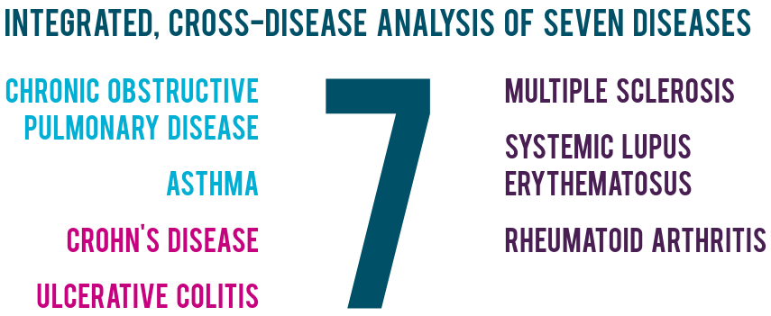

# About

## Development

OmicsDM started as a PhD project of [Ivo Christopher Leist](https://github.com/IvoLeist){target="_blank"}
at [CNAG](https://www.cnag.eu){target="_blank"} in 2020. It was initially developed to serve
as a flexible and scalable **data storage and sharing solution** of processed **omics data**
and its patient's **clinical information** for the [3TR](https://www.3tr-imi.eu){target="_blank"} consortium.
Since Q1 2022 it is in production use by 3TR. Over the years, 3rd-party tools have been integrated
to provide (a) data visualisation and (b) analysis capabilities.
{ .card }

=== "Contributors"
    ###### Documentation
      - [Manuel Rueda]()

    ###### Analysis pipelines
      - [Anna Esteve-Codina](https://scholar.google.com/citations?user=296EwRUAAAAJ){target="_blank"} 
        & [Beatriz Martin](https://www.linkedin.com/in/beatrizmartinmur/){target="_blank"} 

=== "Acknowledgements"
    ##### CNAG
      - [Ivo G. Gut](https://scholar.google.com/citations?user=YKdDEVYAAAAJ) and his 
        [team](https://www.cnag.eu/teams/genome-research-unit/biomedical-genomics-group)

      - [Davide Piscia](https://github.com/dpiscia) and his 
        [team](https://www.cnag.eu/teams/bioinformatics-unit/data-platforms-and-tools-development)

    ###### 3TR
      - [Guillermo Barturen](https://scholar.google.com/citations?hl=en&user=Sq0hugoAAAAJ)

## 3TR

  
  

    
  

  
  

    
  
  

