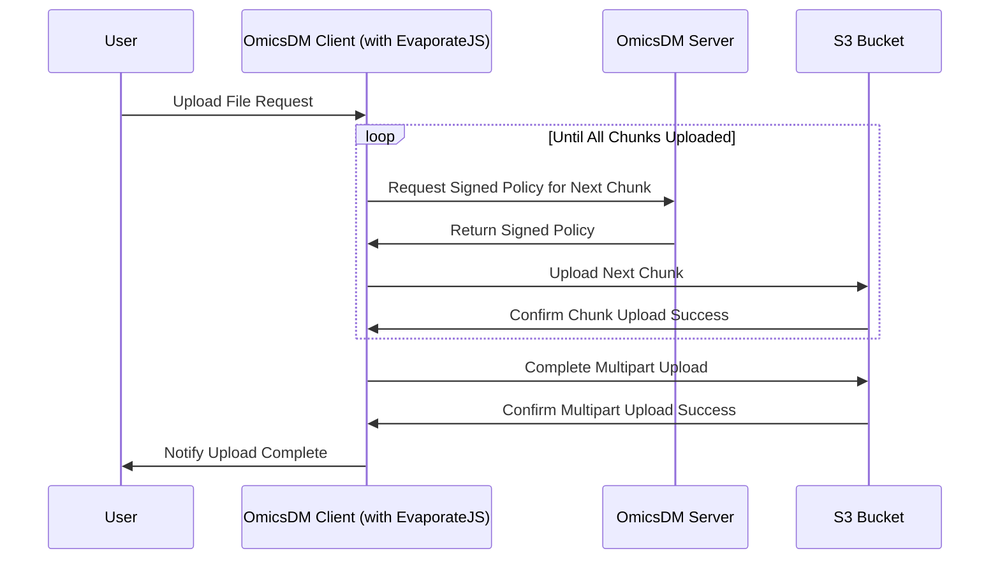
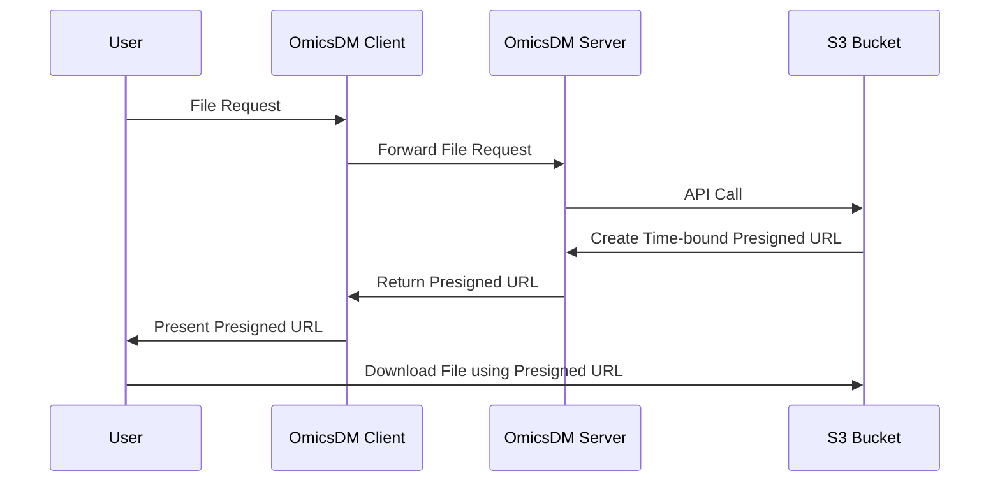

# Distributed File Storage

The OmicsDM data warehouse solution employs [MinIO](https://min.io), 
a S3-compatible object storage server, to store all uploaded files,
in a so-called S3 bucket. 

## File Upload Driven by EvaporateJS

The file upload is driven by [EvaporateJS](https://github.com/TTLabs/EvaporateJS) 
a JavaScript library that allows for large file uploads
directly from the browser to the S3 bucket.

## File Download leveraging presigned URLs

For each file selected to be downloaded, the user receives a unique download link,
a so-called presigned URL. 

## Automatic File Versioning

The OmicsDM data warehouse solution comes with automatic file versioning:

A re-upload of a file with the same name will not overwrite the existing file on the S3 bucket
but create a new version of it.

## File deletion

To prevent accidental deletion of files, the OmicsDM data warehouse solution has no method to delete any
to the S3 bucket uploaded files. The only option the user gets is to mark a file as "deleted".
This switches a boolean flag in the database, preventing 

(a) The file from being shown in the files overview

(b) The generation of a pre-signed URL for the download of the respective file