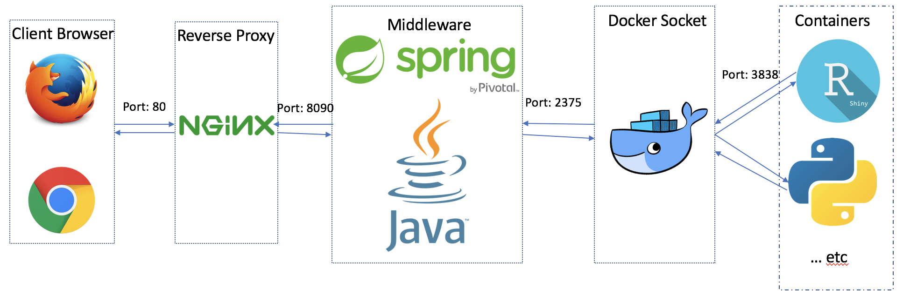

# Docker container orchestration

!!! Info
    This page explains the concept how OmicsDM provides private data visualisation environments to its users.

OmicsDM employs [Docker](https://www.docker.com){target="_blank"} 
containers to provide private data visualisaton environments to its users.
These containers are ochestrated by [ShinyProxy](https://shinyproxy.io){target="_blank"}, 
a Java-based web application that was initially developed by Open Analytics to deploy Shiny applications. Over the years, ShinyProxy has evolved to support any other containerised applications as well. An conceptual overview is shown below.

<figure markdown>
   { width="100%" }
   <figcaption>
        Shinyproxy Overview from
         
        
            <a href="https://lukesingham.com/shiny-containers-with-shinyproxy">
                lukesingham.com/shiny-containers-with-shinyproxy
            </a>
        
    </figcaption>
</figure>