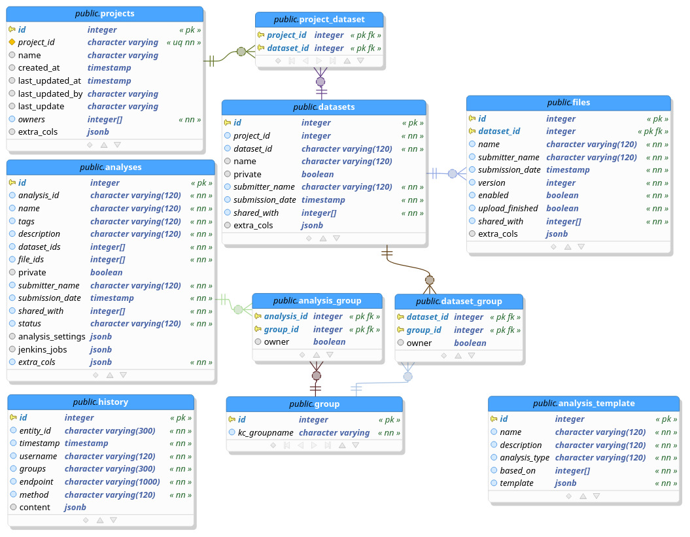

# SQL Tables

Note the frequent use of the entity attribute ***extra_cols***.
It got introduced to allow for a flexible schema, so additional attributes 
can be added to an entity without the need to change the database schema.
See below how that concept is leveraged in 3TR:

!!! Info "3TR-specific"
	    