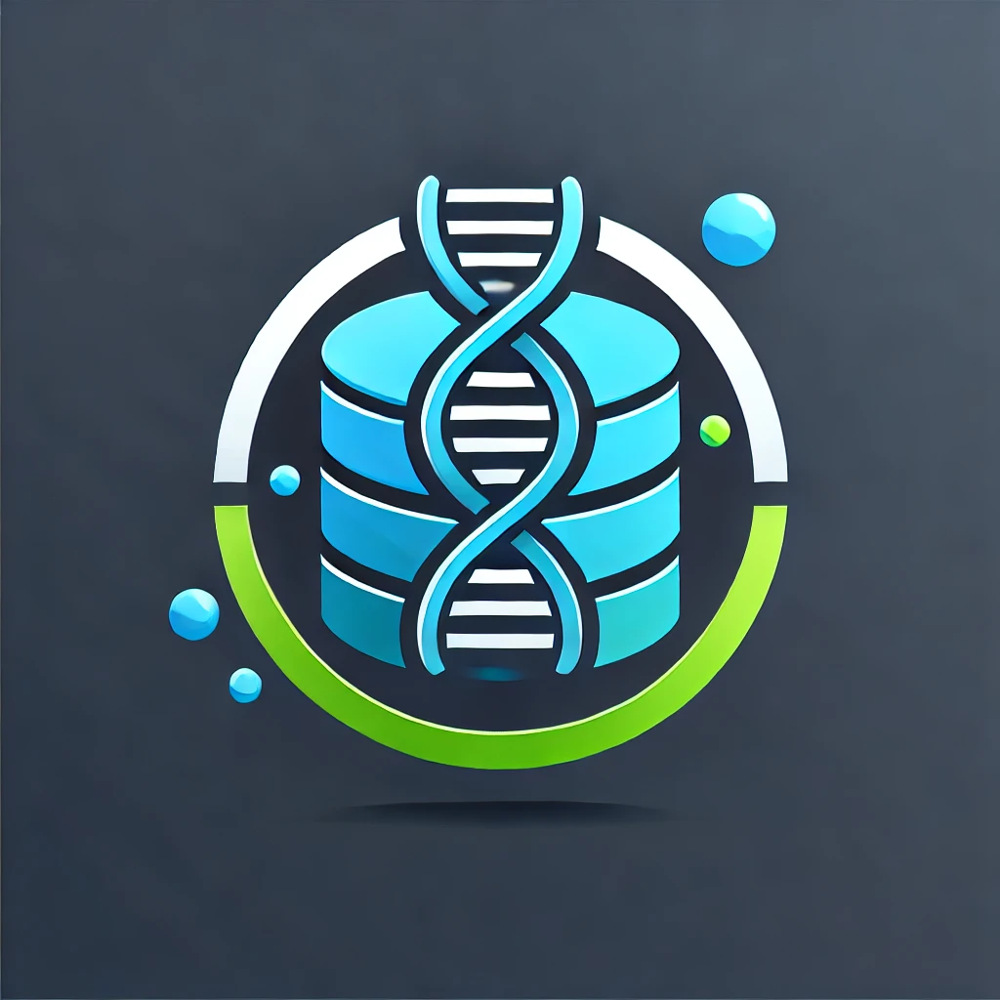

# What is OmicsDM?

OmicsDM is an **open-source** web-based data warehouse solution that 
not only allows the storage and sharing of data 
but also provides functionalities to start data visualisation instances 
such as [CELLxGENE Annotate](https://github.com/chanzuckerberg/cellxgene) 
and run analyses directly in the data warehouse.

<figure markdown> 
    {width="350"}
	<figcaption>
		Placeholder logo created with [DALL·E 3](https://openai.com/index/dall-e-3)
	</figcaption>
</figure>

!!! Tip "Good to know"
    `OmicsDM` is the data backbone of the [3TR project](https://www.3tr-imi.eu){target="_blank"}.